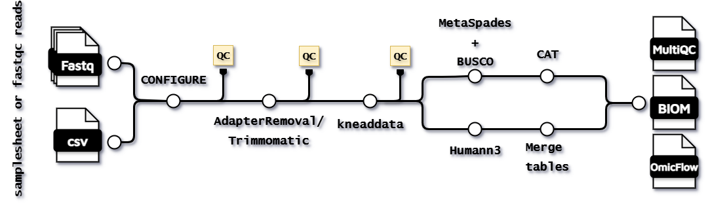

[](https://github.com/CMG-GUTS/metabiomx/actions/workflows/nf-build-stub.yaml)
[](https://www.nextflow.io/)
[](https://www.docker.com/)
[](https://sylabs.io/docs/)
[](https://code.askimed.com/nf-test)

## Introduction: **metaBIOMx**

The metagenomics microbiomics pipeline is a best-practice suite for the decontamination and annotation of sequencing data obtained via short-read shotgun sequencing. The pipeline contains [NF-core modules](https://github.com/nf-core/modules) and other local modules that are in the similar format. It can be runned via both docker and singularity containers.

<p align="center">
    
</p>

## Pipeline summary
The pipeline is able to perform different taxonomic annotation on either (single/paired) reads or contigs. The different subworkflows can be defined via `--bypass_<method>` flags, a full overview is shown by running `--help`. By default the pipeline will check if the right databases are present in the right formats, when the path is provided. If this is not the case, compatible databases will be automatically downloaded.

For both subworkflows the pipeline will perform read trimming via [Trimmomatic](https://github.com/timflutre/trimmomatic) and/or [AdapterRemoval](https://github.com/MikkelSchubert/adapterremoval), followed by human removal via [Kneaddata](https://huttenhower.sph.harvard.edu/kneaddata/). Before and after each step the quality control will be assessed via [fastqc](https://www.bioinformatics.babraham.ac.uk/projects/fastqc/) and a [multiqc](https://github.com/MultiQC/MultiQC) report is created as output. Then taxonomy annotation is done as follows:

**Read annotation**
- paired reads are interleaved using [BBTools](https://archive.jgi.doe.gov/data-and-tools/software-tools/bbtools/).
- [MetaPhlAn3](https://huttenhower.sph.harvard.edu/metaphlan/) and [HUMAnN3](https://huttenhower.sph.harvard.edu/humann/) are used for taxonomy and functional profiling.
- taxonomy profiles are merged into a single BIOM file using [biom-format](https://github.com/biocore/biom-format).

**Contig annotation**
- read assembly is performed via [SPAdes](http://cab.spbu.ru/software/spades/).
- Quality assesment of contigs is done via [Busco](https://busco.ezlab.org/).
- taxonomy profiles are created using [CAT](https://github.com/dutilh/CAT).
- Read abundance estimation is performed on the contigs using [Bowtie2]() and [BCFtools](http://samtools.github.io/bcftools/bcftools.html).
- Contigs are selected if a read can be aligned against a contig and a BIOM file is generated using [biom-format](https://github.com/biocore/biom-format).

## Installation
> [!NOTE]
> Make sure you have installed the latest [nextflow](https://www.nextflow.io/docs/latest/install.html#install-nextflow) version! 

Clone the repository in a directory of your choice:
```bash
git clone https://github.com/CMG-GUTS/metabiomx.git
```

The pipeline is containerised, meaning it can be runned via docker or singularity images. No further actions need to be performed when using the docker profile, except a docker registery needs to be set on your local system, see [docker](https://docs.docker.com/engine/install/). In case singularity is used, images are automatically cached within the project directory.

## Usage
Since the latest version, metaBIOMx works with both a samplesheet (CSV) format or a path to the input files. Preferably, samplesheets should be provided.
```bash
nextflow run main.nf --input <samplesheet.csv> -work-dir work -profile singularity
nextflow run main.nf --input <'*_{1,R1,2,R2}.{fq,fq.gz,fastq,fastq.gz}'> -work-dir work -profile singularity
```

### 📋 Sample Metadata File Specification

metaBIOMx expects your sample input data to follow a **simple, but strict** structure to ensure compatibility and allow upfront validation. The input should be provided as a **CSV** file where **each entry = one sample** with specified sequencing file paths. Additional properties not mentioned here will be ignored by the validation step.

---

### **Minimum requirement**
- **`sample_id`** ➡ every entry **must** have a unique, non-empty sample identifier.
- No spaces are allowed in sample IDs — use underscores `_` or dashes `-` instead.
- **`forward_read`** ➡ every entry **must** provide a path to an existing forward read FASTQ file (gzipped).
- If `reverse_read` is provided, `forward_read` must also be present.
Example:

| sample_id | forward_read | reverse_read |
|-----------|---------------|--------------------|
| sample1   | sample1_R1.fastq.gz | sample1_R2.fastq.gz |
| sample_2  | D029327_1.fastq.gz | D029327_2.fastq.gz |
| S3        | L9283_R1.fastq.gz | L9283_R1.fastq.gz |

---

### **Properties and Validation Rules**

#### 🔹 Required properties

| Property     | Type   | Rules / Description                                                                                   |
|--------------|--------|----------------------------------------------------------------------------------------------------|
| `sample_id`     | string | Unique sample ID with no spaces (`^\S+$`). Serves as an identifier.                                  |
| `forward_read` | string | File path to forward sequencing read. Must be non-empty string matching FASTQ gzipped pattern. File must exist. |

#### 🔹 Optional property

| Property       | Type   | Rules / Description                                                                                   |
|----------------|--------|----------------------------------------------------------------------------------------------------|
| `reverse_read` | string | File path to reverse sequencing read. Same constraints as `forward_read`. Required if specified.   |

#### 🔹 Pattern‑based columns 
You can define extra variables using special prefixes:
- **`CONTRAST_...`** → grouping/category labels used in differential comparisons  
  Example: `CONTRAST_Treatment` with values `Drug` / `Placebo`
These prefixes are used to generate an automated `OmicFlow` report with alpha, beta diversity and compositional plots. For more information see [OmicFlow](https://github.com/agusinac/OmicFlow).

### Example cases
#### 🔹 Read annotation
```bash
nextflow run main.nf \
    --input <samplesheet.csv> \
    # (optional) --bypass_trim \
    # (optional) --bypass_decon \
    --bypass_contig_annotation \
    -work-dir work \
    -profile singularity
```

#### 🔹 Contig annotation
```bash
nextflow run main.nf \
    --input <samplesheet.csv> \
    # (optional) --bypass_trim \
    # (optional) --bypass_decon \
    --bypass_read_annotation \
    -work-dir work \
    -profile singularity
```

In case you only have assemblies and wish to perform contig annotation:
```bash
nextflow run main.nf \
    --input <samplesheet.csv> \
    --bypass_assembly \
    --bypass_read_annotation \
    -work-dir work \
    -profile singularity
```

## Automatic database setup
The pipeline requires a set of databases which are used by the different tools within this workflow. The user is required to specify the location in where the databases will be downloaded. It is also possible to download the databases manually. The `configure` subworkflow will evaluate the database format and presence of the compatible files automatically.
```bash
nextflow run main.nf \
    --bowtie_db path/to/db/bowtie2 \
    --metaphlan_db path/to/db/metaphlan \
    --humann_db path/to/db/humann \
    --catpack_db path/to/db/catpack \
    --busco_db path/to/db/busco_downloads \
    -work-dir <work/dir> \
    -profile <singularity,docker>
```

<details>
<summary>Manual database setup</summary>

### HUMAnN3 and MetaPhlan3 DB
Make sure the `path/to/db/humann` should contain a `chocophlan`, `uniref` and `utility_mapping` directory. These can be obtained by the following command:
```bash
docker pull biobakery/humann:latest

docker run --rm -v $(pwd):/scripts biobakery/humann:latest \
    humann_databases --download chocophlan full ./path/to/db/humann \
    && humann_databases --download uniref uniref90_diamond ./path/to/db/humann \
    && humann_databases --download utility_mapping full ./path/to/db/humann
```

### MetaPhlAn DB
```bash
wget http://cmprod1.cibio.unitn.it/biobakery4/metaphlan_databases/mpa_vJun23_CHOCOPhlAnSGB_202403.tar \
    && tar -xvf mpa_vJun23_CHOCOPhlAnSGB_202403.tar -C path/to/db/metaphlan \
    && rm mpa_vJun23_CHOCOPhlAnSGB_202403.tar

wget http://cmprod1.cibio.unitn.it/biobakery4/metaphlan_databases/bowtie2_indexes/mpa_vJun23_CHOCOPhlAnSGB_202403_bt2.tar \
    && tar -xvf mpa_vJun23_CHOCOPhlAnSGB_202403_bt2.tar -C path/to/db/metaphlan \
    && rm mpa_vJun23_CHOCOPhlAnSGB_202403_bt2.tar

echo 'mpa_vJun23_CHOCOPhlAnSGB_202403' > path/to/db/metaphlan/mpa_latest
```

### Kneaddata DB
```bash
docker pull agusinac/kneaddata:latest

docker run --rm -v $(pwd):/scripts agusinac/kneaddata:latest \
    kneaddata_database \
        --download human_genome bowtie2 ./path/to/db/bowtie2
```

### CAT_pack DB
A pre-constructed diamond database can be [downloaded](https://tbb.bio.uu.nl/tina/CAT_pack_prepare/) manually or by command:
```bash
docker pull agusinac/catpack:latest

docker run --rm -v $(pwd):/scripts agusinac/catpack:latest \
    CAT_pack download \
        --db nr \
        -o path/to/db/catpack

```

### busco DB
BUSCO expects that the directory is called `busco_downloads`.
```bash
docker pull ezlabgva/busco:v5.8.2_cv1

docker run --rm -v $(pwd):/scripts ezlabgva/busco:v5.8.2_cv1 \
    busco \
        --download bacteria_odb12 \
        --download_path path/to/db/busco_downloads
```
</details>

## Support

If you are having issues, please [create an issue](https://github.com/CMG-GUTS/metabiomx/issues)

## Citations

You can cite the `metabiomx` using the following DOI: https://doi.org/10.48546/workflowhub.workflow.1787.6

An extensive list of references for the tools used by the pipeline can be found in the [`CITATIONS.md`](CITATIONS.md)
file.
